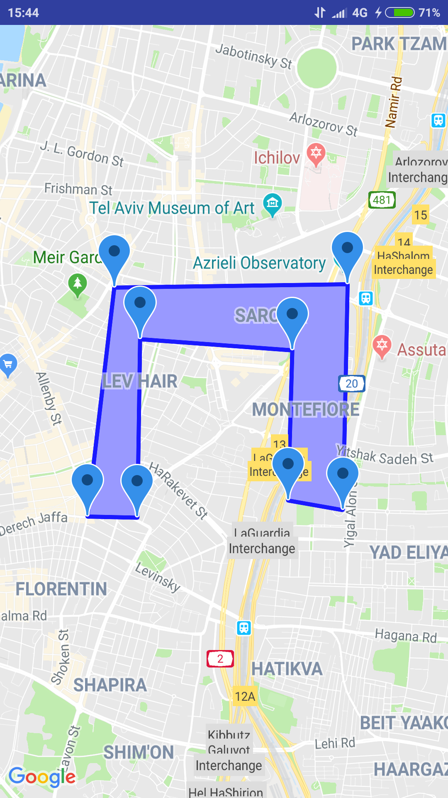

# MapTest
Productionize an app as part of an interview test.

## What I Learned
- Show Google Map.
- Pinpoint a specific location and zoom in accordingly. 
- Make a rectangale out of multiple points and mark the field inside it.
- Draggable points that adjust the field accordingly.
- Google API Methods such as containsLocation & distanceToLine.

## App Description
- Loads the map and zooms in to the relevant location.
- Draggable points that can adjust the inner field.
- Pinpoint outside of the rectangle will show nearest distance to the rectangle.
- Pinpoint inside of the rectangle will tell if its inside or not.

-----------------------
 
 

